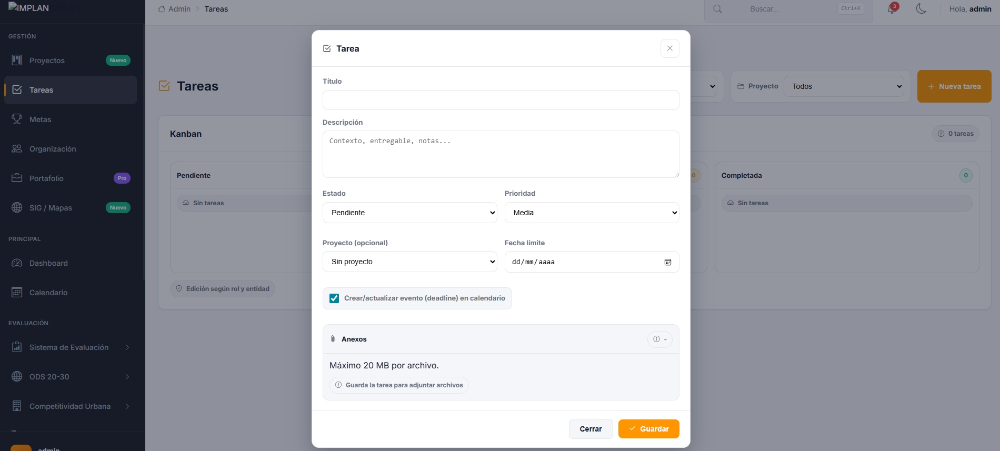
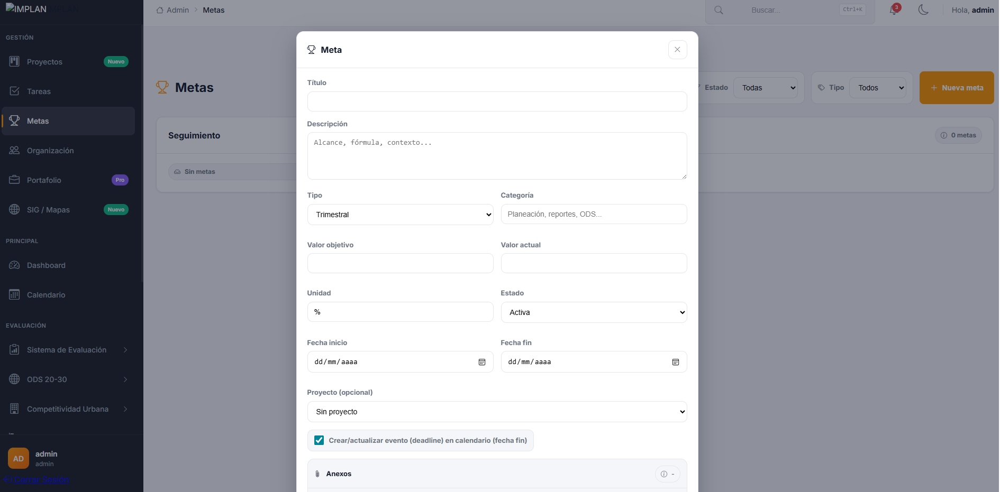
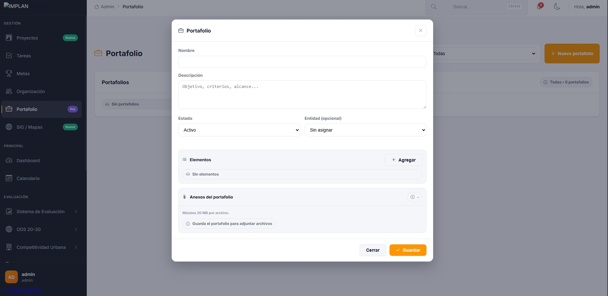
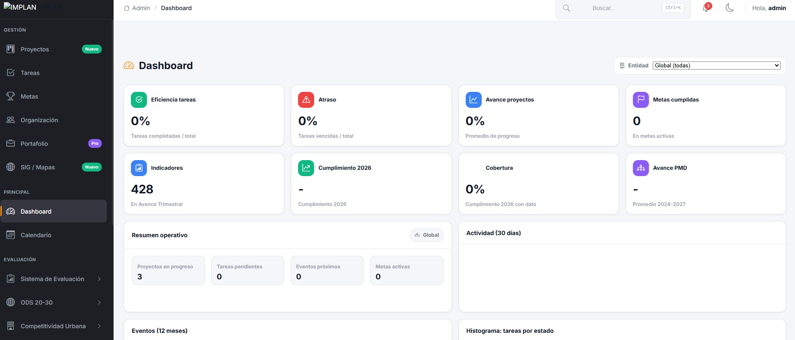
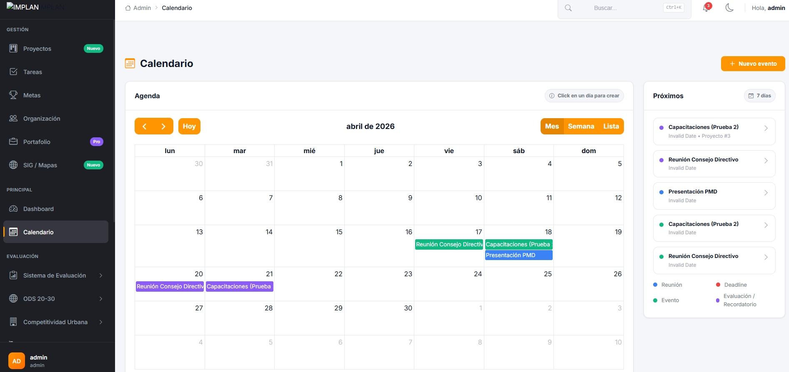
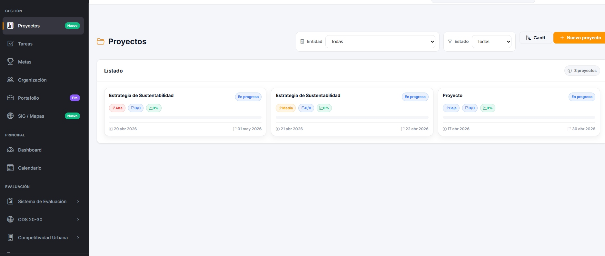
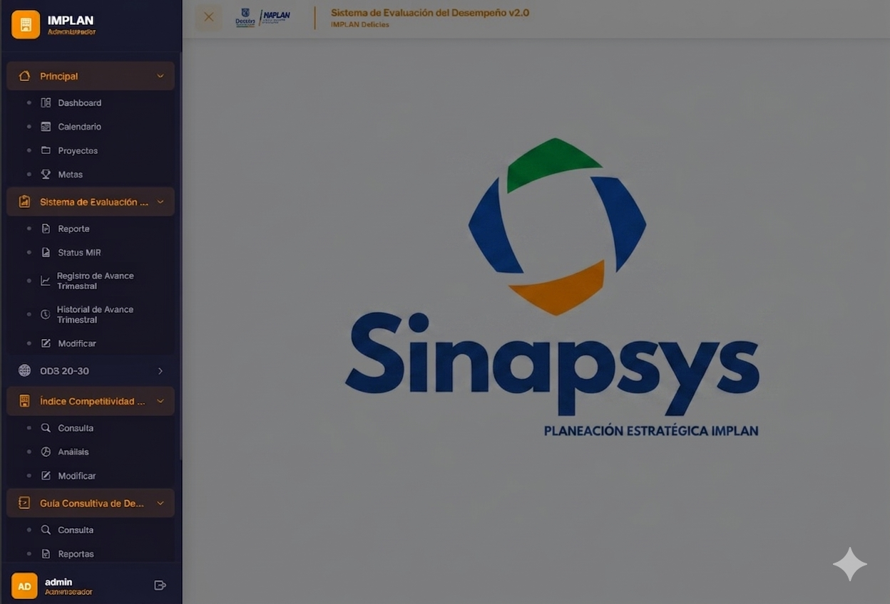
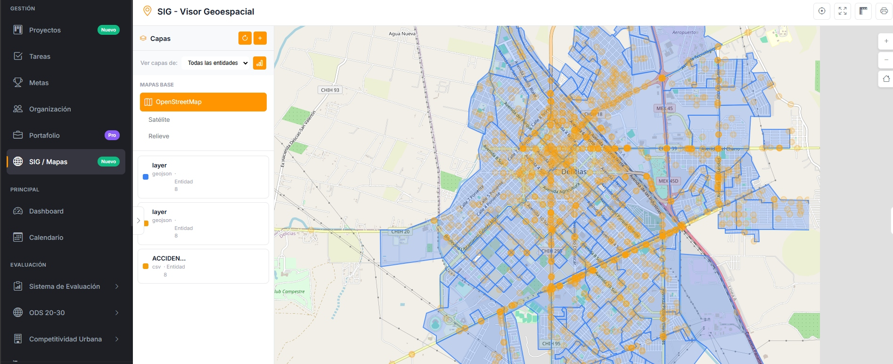

# SINAPSYS ERP

**Sistema Integral de Administración, Planeación y Seguimiento del Municipio de Delicias**

SINAPSYS ERP es una plataforma institucional desarrollada para centralizar la administración de información, proyectos, metas, indicadores, actividades, calendarios, evaluaciones y visualización geoespacial de las distintas entidades del Municipio de Delicias. Su objetivo principal es resolver la dispersión operativa y la falta de control unificado sobre la información estratégica de gobierno, proporcionando una base sólida para la toma de decisiones, el seguimiento de resultados y la coordinación entre dependencias [file:5].

---

## Descripción del proyecto

El desarrollo de SINAPSYS ERP nació de una necesidad real: no existía un sistema único capaz de administrar de forma ordenada la información operativa y estratégica de todas las entidades municipales, ni de ofrecer trazabilidad sobre proyectos, metas, indicadores, avances y reportes para más de 232 usuarios con acceso al sistema [file:5]. Esta situación generaba duplicidad de esfuerzos, falta de visibilidad, dificultad para consolidar datos y limitaciones para evaluar resultados de manera oportuna [file:5].

A partir de ese problema, se diseñó una solución web institucional con arquitectura modular, enfoque por entidad, control de accesos por rol y una lógica orientada a la planeación estratégica, el seguimiento de desempeño y la gestión operativa [file:5]. El resultado es un ERP municipal que integra gestión, evaluación y visualización de información en un solo entorno [file:5].

---

## Problema que resuelve

Antes de SINAPSYS ERP, la información del municipio se encontraba distribuida entre múltiples fuentes, archivos aislados, procesos manuales y reportes sin unificador central [file:5]. Esto provocaba dificultad para concentrar información por entidad, falta de visibilidad en proyectos y metas, poca trazabilidad sobre actividades y responsables, y ausencia de una plataforma integral para usuarios operativos, administrativos y de evaluación [file:5].

SINAPSYS ERP fue creado para resolver ese vacío mediante una arquitectura centralizada, escalable y funcional [file:5].

---

## Objetivos del sistema

- Centralizar la información institucional en una sola plataforma.
- Administrar proyectos, tareas, metas e indicadores por entidad.
- Dar seguimiento a resultados, avances y cumplimiento.
- Facilitar la consulta de dashboards y reportes ejecutivos.
- Integrar módulos de evaluación, planeación y georreferenciación.
- Controlar accesos mediante roles y entidades.
- Mejorar la eficiencia operativa de los equipos municipales [file:5].

---

## Alcance institucional

El sistema fue diseñado para operar dentro del ecosistema administrativo del Municipio de Delicias, dando soporte a dependencias y entidades municipales, usuarios operativos y administrativos, procesos de planeación estratégica, evaluación de desempeño, seguimiento de metas e interpretación de resultados, y visualización de información territorial mediante SIG/Mapas [file:5].

Actualmente, la plataforma da servicio a más de 232 usuarios con diferentes niveles de acceso y responsabilidades, lo que convierte al sistema en una herramienta clave para la operación institucional [file:5].

---

## Arquitectura tecnológica

SINAPSYS ERP fue desarrollado con un enfoque pragmático, estable y compatible con infraestructura gubernamental existente [file:5].

- **Backend:** PHP 8.x con PDO/SQLSRV [file:5].
- **Base de datos:** SQL Server, en entornos Azure y on-premise [file:5].
- **Frontend:** HTML5, CSS3, JavaScript vanilla y jQuery [file:5].
- **API central:** `erp-api.php` [file:5].
- **UI y componentes:** Bootstrap 5, FullCalendar, Chart.js y Leaflet [file:5].

Esta combinación permitió construir un sistema robusto, ligero y adaptable a requerimientos institucionales [file:5].

---

## Estructura del proyecto

```text
sistema/
├── api/
│   └── erp-api.php
├── assets/
│   ├── css/
│   ├── js/
│   └── image/
├── config/
│   └── menu-config.php
├── database/
├── modulo/
│   ├── admin/
│   ├── header/
│   └── usuario/
└── data/
    ├── config.php
    └── conexion.php
```

---

## Módulos implementados

### ERP Core
- Dashboard.
- Calendario.
- Proyectos.
- Tareas.
- Metas.
- Organización.
- Portafolio.
- SIG / Mapas.

### Evaluación y desempeño
- Sistema de Evaluación.
- Status MIR.
- Avance Trimestral.
- ODS 20-30.
- Competitividad Urbana.
- Guía Consultiva de Desempeño Municipal.
- PMTODU [file:5].

---

## Modelo de datos

El diseño de datos se construyó con enfoque multientidad, permitiendo que cada registro quede asociado a una entidad municipal [file:5].

### Tablas principales
- `dbo.Entidades`
- `dbo.User_Data`
- `erp_proyectos`
- `erp_tareas`
- `erp_metas`
- `erp_eventos`
- `erp_actividad`
- `erp_organizacion`
- `erp_portafolios`
- `erp_portafolio_items` [file:5]

### Relaciones clave
- `User_Data.clave_entidad` → `Entidades.clave`.
- Tablas ERP con `clave_entidad` → `Entidades.clave`.
- Proyectos ↔ Tareas.
- Proyectos ↔ Metas.
- Proyectos/Tareas/Metas ↔ Eventos [file:5].

Este modelo permitió mantener el orden lógico de la información y evitar cruces incorrectos entre entidades [file:5].

---

## Control de acceso

El sistema implementa control de acceso basado en roles [file:5]:

| Rol | Descripción | Acceso |
|---|---|---|
| `admin` | Administrador | Acceso total |
| `editor` | Editor | Lectura y edición limitada |
| `user` | Usuario | Acceso a su información |
| `view` | Visitante | Solo lectura |

Además, la lógica por entidad asegura que cada usuario vea únicamente la información correspondiente a su dependencia, salvo el rol administrador, que puede visualizar todas las entidades [file:5].

---

## Lógica de solución

Uno de los retos más importantes fue resolver la inconsistencia en los campos usados para identificar entidades dentro de la base de datos [file:5]. Durante la auditoría se detectó que algunos procesos utilizaban `clave_entidad`, mientras otros usaban `entidad_clave` o `clave`, lo que ocasionaba fallas de visibilidad y filtros incorrectos [file:5].

Para resolverlo se implementó una estrategia de normalización y detección dinámica de columnas, priorizando la consistencia entre usuarios, entidades y tablas operativas [file:5]. Esto permitió corregir accesos por entidad, alinear la estructura de datos, reducir errores de filtrado, mejorar la confiabilidad del ERP y consolidar una fuente de verdad para la sesión del usuario [file:5].

---

## Valor funcional

SINAPSYS ERP no solo administra información; también transforma datos operativos en información útil para la gestión pública [file:5].

Permite:
- Seguir proyectos desde su planeación hasta su cierre.
- Medir avances y resultados.
- Consultar información geoespacial en mapas.
- Organizar actividades por entidad.
- Vincular metas con responsables y fechas.
- Visualizar indicadores para la toma de decisiones [file:5].

---

## Capturas del sistema

### Dashboard


### Calendario


### Portafolio


### Metas


### Tareas


### Proyectos


### SINAPSYS


### SIG / Mapas


---

## Métricas del sistema

- Más de 80 archivos PHP.
- Más de 15 scripts SQL.
- 8 módulos ERP principales.
- Aproximadamente 2,500 líneas en la API central.
- 4 roles de acceso.
- Más de 20 entidades registradas en la base de datos [file:5].

---

## Impacto

SINAPSYS ERP fue desarrollado para atender una necesidad real de gestión pública: pasar de procesos dispersos y manuales a una plataforma integrada, medible y escalable [file:5]. Su implementación mejora el control administrativo, fortalece la planeación institucional y facilita el seguimiento de resultados en múltiples dependencias del municipio [file:5].

En términos prácticos, el sistema representa una base tecnológica para ordenar la operación municipal, consolidar la información y mejorar la trazabilidad de los procesos internos [file:5].

---

## Estado actual

El sistema cuenta con módulos funcionales de gestión, evaluación y visualización [file:5]. La auditoría confirmó que la arquitectura base está operativa y también identificó ajustes pendientes relacionados con la migración definitiva de estructura de entidades y validaciones de datos [file:5].

---

## Recomendaciones futuras

- Implementar auditoría de acciones y logs.
- Agregar exportación PDF/Excel.
- Incluir notificaciones automáticas.
- Incorporar adjuntos y evidencias.
- Evolucionar a un framework moderno.
- Añadir WebSockets para información en tiempo real.
- Contenerizar el entorno con Docker [file:5].

---

## Autor

Desarrollado por **Alonso Villalobos Lara**  
Enfoque profesional en análisis de datos, planeación estratégica, BI y desarrollo de soluciones institucionales.

---

## Licencia

Uso institucional y académico.  
La distribución o reutilización debe respetar la autoría y el contexto del proyecto.
